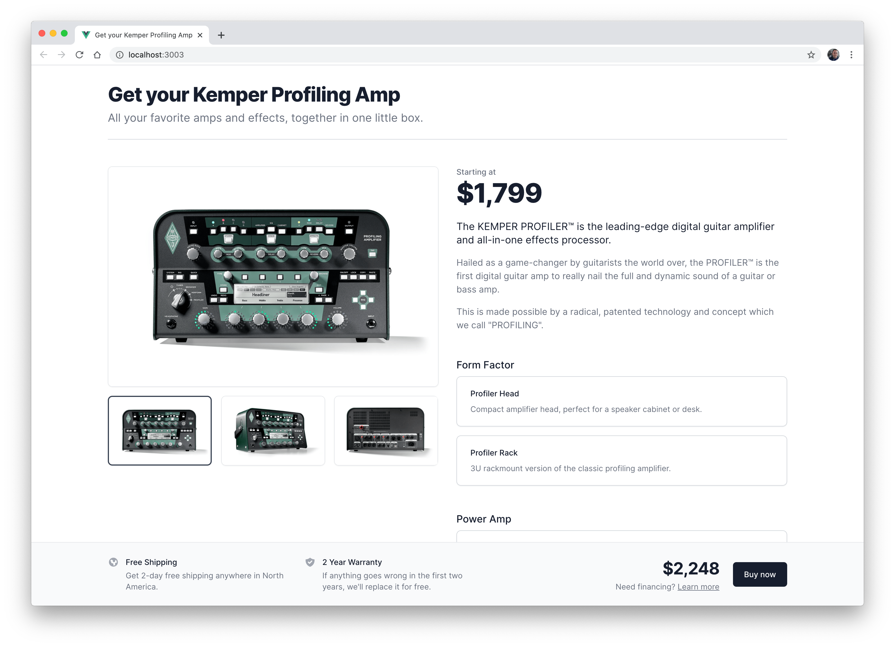

# Tailwind UI Take-Home Test

Your task is to take the included design (`design.fig`, a [Figma](https://figma.com) file) and build it with Tailwind and either React or Vue.

We've included two starter projects in this zip file:

- A Next.js project (in the `react` folder)
- A vue-cli project (in the `vue` folder)

**You should only complete one of them** — just pick the framework you know best and can be most productive in.

- If you choose the React project, use `npm run dev` or `yarn dev` to spin up the dev server and start your work in `react/pages/index.js`
- If you choose the Vue project, use `npm run serve` or `yarn serve` to spin up the dev server and start your work in `vue/src/App.vue`

We've included the `@tailwindcss/ui` plugin in both projects which provides an updated color palette for Tailwind (it's the one we use in [Tailwind UI](https://tailwindui.com)) and is the color palette we've used in the design. It also includes a lot of additional default values for other utilities, like an extended spacing scale, more top/right/bottom/left utilities, additional shadows, and more.

To see the extra values added by the plugin, [take a look at the source here](https://unpkg.com/browse/@tailwindcss/ui@0.3.0/index.js).

We've also preconfigured the `Inter` font family, since that's what we're using in the design.

The images used in the design have already been added to both test projects, under `public/img`.

The two SVG icons used in the design are in the `icons` folder.

### What we're looking for

- **Attention to detail.** Everything in the design matches a value in Tailwind (unless we've made a small off-by-a-pixel mistake here and there, which is possible!), so do your best to match it as closely as possible. This includes colors, font sizes, spacing, line-heights, etc. You can see all of the values in Figma's inspector (on the right hand side) when you select a given element. Whenever possible, we've used "styles" in Figma so it's easy to know what utilities the design maps to. For example, you'll see colors named things like `Gray-500` which is `gray-500` or shadows like `shadow-sm` which of course matches the `shadow-sm` class.
- **Make sure it's responsive.** We've provided designs for every necessary breakpoint, so please make your implementation match the design at each breakpoint.
- **Make it interactive.** Users should be able to select between the different images and see the preview image update, and the total price in the footer should reflect their chosen configuration options above.
- **Make your solution accessible.** Make sure you are using semantic markup, and that your implementation of the interactive pieces is properly accessible (including keyboard navigation and ARIA attribute management).
- **Don't use native form controls.** You could probably build this design using some hidden native form controls and label tricks if you tried hard enough, but that's not going to be possible for everything we ever build. For the purposes of this take home project, we want to see that you can build completely custom ARIA compliant controls when it's inevitably needed, so please use custom controls for this one even if you can think of a clever way to avoid it.
- **Build your components from scratch.** Don't use any existing React or Vue UI libraries for the image picker or the configuration options.
- **Make the custom controls general purpose and reusable.** They don't have to be completely universal or absolutely bullet-proof like something we'd spend a lot of time on if it were going to be an open-source library, but we'd love to at least get a sense of how you'd approach the overall API design if you were building these controls to be consumed by other people in different projects.

### What we're not looking for

- **Don't worry about old browsers.** You can use whatever modern features you like, like CSS Grid for example. We don't care if it's completely broken in IE 11.
- **You don't need to go crazy in terms of componentization.** Extract components when it helps you maintain what would otherwise be annoying duplication, but don't break things apart needlessly. We just want to see that you can implement the design in a robust way with good HTML semantics, and that you can get all of the interactive pieces working properly. Aside from the custom interactive controls, build it as if it's literally a one-page website, not part of a bigger, more complex application where many of the components would be re-used. For example it's fine for the headline to be hard-coded into the template instead of imagining this as a page that could show any arbitrary product.
- **You don't need to create an API or anything.** It's totally fine if any data you feed in to the page is just hard-coded fixture data, and you definitely don't need to do any backend work for handling the "Buy now" button in any way. Think of it more like something you'd throw on CodePen than as a real application.
- **You don't need to write tests.** If they help you then sure go for it, but don't prioritize them over getting the design implemented and functioning if they would slow you down.

### Demo walkthrough

We've included a little screencast that walks through my own version of the design so you can get a better sense for how some things are supposed to work that might be a little harder to capture in Figma. Make sure you watch the screencast before starting on your implementation.

There are a couple details in the screencast that don't quite match the Figma design, so if you notice any differences treat the Figma design as the source of truth.

### Submitting your solution

Along with your actual code, put together a short `README.md` file for your solution that talks about any interesting things you ran into, decisions you made, etc. Think of it like a little postmortem just to talk through anything you found notable about the project. You can also use it as a place to explain any "I know this might look weird at first glance but hear me out..." sort of decisions you made.

When you're done, create a private repo on GitHub that just contains your project (so just the `react` or `vue` folder contents) and invite me to it (I'm `adamwathan`).

Once we've had a chance to review your submission we'll get back to you with next steps.

Thank you! ❤️
